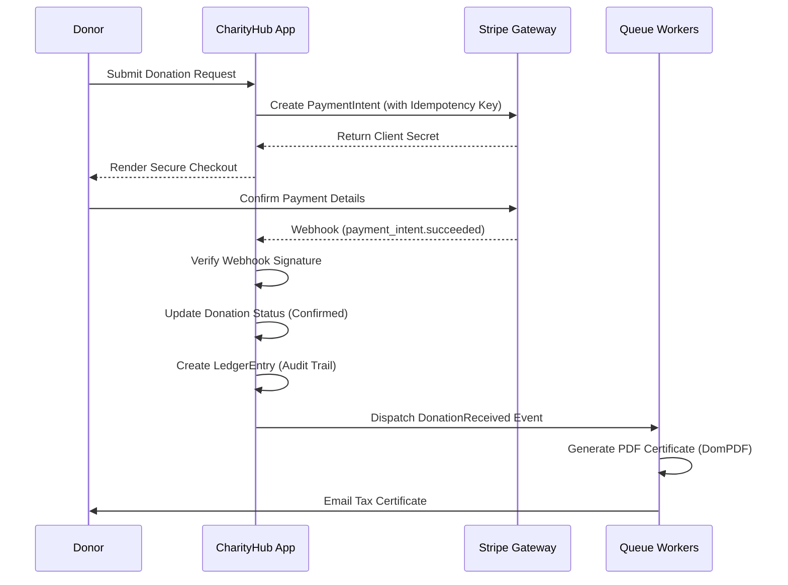

# Technical Architecture

## 1. Database Schema
The system uses a relational database structure designed for integrity and auditability:
- **`users`**: Stores admin, donor, and volunteer accounts (managed via Spatie Roles).
- **`campaigns`**: Core fundraising initiatives containing financial goals, deadlines, and current raised amounts.
- **`donations`**: Tracks individual transactions, statuses (pending, confirmed, failed), transaction amounts, and idempotency keys.
- **`charity_subscriptions`**: Manages recurring monthly/yearly donations linked to Stripe Subscriptions.
- **`ledger_entries`**: Immutable double-entry logging for every confirmed financial transaction to maintain an audit trail.
- **`volunteer_schedules`**: Tracks volunteer shifts, preventing overlaps via conflict detection and logging completed hours.
- **`impact_reports`**: Summaries of campaign outcomes, associated with campaigns, containing geodata for map rendering.

## 2. Payment Flow Diagram

## 3. API Documentation
API documentation is automatically generated using the **Scribe** package from your code's docblocks. 
- **To view:** Navigate to `YOUR_APP_URL/docs` in the browser.
- **To update:** Run `php artisan scribe:generate` in the terminal to parse new routes and controllers into the documentation.
